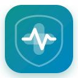

<p align="center">
  
</p>

<h1 align="center"><b>MedBuddy</b></h1>

<p align="center">
  <b>Personal & Family Medical Vault with Local-First AI Analysis</b>
</p>

<p align="center">
  <a href="https://github.com/medbuddy/medbuddy/releases"></a>
  
  
  
  
  
</p>

---

## 🩺 Overview

**MedBuddy** is a secure, local-first desktop application designed to organize, catalog, and analyze your entire family's medical records. From messy lab PDFs and physical doctor prescriptions to hospital discharge summaries and radiology scans, MedBuddy turns scattered health documents into structured, searchable health profiles and longitudinal timelines.

Built with a **privacy-first architecture**, all sensitive documents, profiles, and SQLite databases remain strictly on your local machine. When analyzing reports, you have complete control over whether processing stays **100% offline** (via local LLMs like Ollama or LM Studio) or connects via **BYOK** (Bring Your Own Key) to leading cloud providers.

---

## 🖥️ Platform Availability & Downloads

> **Yes! Because MedBuddy is built on Electron, it is officially supported across Windows, macOS, and Linux.**

Prebuilt, ready-to-run installation packages and standalone bundles are published with every release. Download the appropriate binary for your system from the **[GitHub Releases](https://github.com/medbuddy/medbuddy/releases)** page:

| Operating System | Supported Architectures | Available Package Formats | Notes |
| :--- | :--- | :--- | :--- |
| **Windows** | `x64`, `arm64` | `.exe` (NSIS Installer), `.exe` (Portable) | Windows 10 & 11 supported |
| **macOS** | Apple Silicon (`arm64`), Intel (`x64`) | `.dmg`, `.zip` (Universal & Native) | macOS 11+ (Big Sur through Sequoia) |
| **Linux** | `x64`, `arm64` | `.AppImage`, `.deb`, `.rpm` | Ubuntu, Debian, Fedora, Arch, and derivatives |

---

## ✨ Key Features

- **👨‍👩‍👧‍👦 Multi-Profile Family Vault**: Manage discrete records for yourself, children, and elderly parents under segregated profiles with custom avatars, dates of birth, and health notes.
- **📁 Nested Folder Organization**: Hierarchical file system (e.g., `Mom → Cardiology → 2024 → Echocardiogram`) supporting multi-format files (PDFs, JPEG, PNG, TIFF, HEIC).
- **🔍 Offline Local OCR**: Embedded **PaddleOCR** running via **ONNX Runtime** extracts text from low-contrast scans, mobile photos, and multi-page PDFs with zero internet connectivity.
- **🧠 Flexible Dual-Engine AI (Local vs. BYOK Cloud)**:
  - **100% Local / Offline**: Native integration with **Ollama** (`llama3.2`, `mistral`, `deepseek-r1`, `phi3`) or **LM Studio** via OpenAI-compatible endpoints (`localhost:11434`, `localhost:1234`).
  - **BYOK Cloud Providers**: Optional integration with OpenAI (GPT-4o), Anthropic (Claude 3.5 Sonnet), or Google Gemini with token impact transparency.
- **📊 Structured Clinical Dashboards**: Automatically extracts discrete biomarkers, flags out-of-range indicators (High/Low/Critical), generates plain-language executive summaries, and lists actionable questions for your doctor.
- **📈 Longitudinal Health Timeline**: Chronological tracking of medical events, test results, doctor visits, and medication updates over months and years.
- **⚡ Zero-Cost History Caching**: All generated clinical analyses are cached locally. Revisit any past dashboard instantly without re-processing files or incurring API costs.
- **📤 Export & Share**: Export any generated health dashboard or timeline summary to PDF or image to bring to clinical consultations.
- **☁️ Optional Encrypted Google Drive Sync**: Opt-in encrypted backup for cross-device synchronization, strictly controlled by you.
- **🎨 Refined Modern Interface**: Dark and light modes inspired by modern productivity tools, complete with keyboard shortcuts and connection diagnostics.

---

## 🎯 Primary Use Cases

### 1. Multi-Generational Family Caregiving
Keep vaccination logs, pediatrician visits, and growth charts for your kids alongside chronic prescription histories, cardiologist notes, and annual bloodwork for aging parents.

### 2. Pre-Appointment Doctor Preparation
Before visiting a specialist, select all reports from the last 12 months and run a synthesis. Walk into the examination room with an organized summary of key trends and AI-suggested questions tailored to your recent lab results.

### 3. Tracking Chronic Trends Over Time
Track key indicators such as **HbA1c**, **Lipid Profiles (LDL/HDL)**, **Thyroid (TSH)**, or **Kidney Function (Creatinine/eGFR)** over years, even when tests were performed across different hospitals with differing lab formats.

### 4. Emergency Preparedness & Travel
Carry a completely offline, searchable medical history on your laptop during travel without relying on internet access or hospital patient portals.

---

## 🏗️ Architecture

```
┌────────────────────────────────────────────────────────┐
│                   MedBuddy Desktop                     │
│                                                        │
│  ┌──────────────────────────────────────────────────┐  │
│  │     React 18 + TailwindCSS + Lucide UI           │  │
│  │     (Dashboard, Timeline, File Explorer, OCR)    │  │
│  └────────────────────────┬─────────────────────────┘  │
│                           │ IPC Bridge                 │
│  ┌────────────────────────▼─────────────────────────┐  │
│  │                Electron Main Process             │  │
│  │  ┌─────────────────────────────────────────────┐ │  │
│  │  │ Local SQLite Engine (better-sqlite3)        │ │  │
│  │  │ Documents, Family Members, Cached Overviews │ │  │
│  │  └─────────────────────────────────────────────┘ │  │
│  │  ┌─────────────────────────────────────────────┐ │  │
│  │  │ Local OCR Engine (ONNX + PaddleOCR + Canvas)│ │  │
│  │  └─────────────────────────────────────────────┘ │  │
│  │  ┌─────────────────────────────────────────────┐ │  │
│  │  │ AI Orchestrator (Local Ollama / BYOK Cloud) │ │  │
│  │  └─────────────────────────────────────────────┘ │  │
│  └──────────────────────────────────────────────────┘  │
└────────────────────────────────────────────────────────┘
```

---

## 🚀 Getting Started (Users)

1. Download the latest installer for your operating system from **[Releases](https://github.com/medbuddy/medbuddy/releases)**:
   - **Windows**: Run `MedBuddy-Setup-x.x.x.exe` or use the portable version.
   - **macOS**: Open `MedBuddy-x.x.x.dmg` and drag MedBuddy into your `Applications` folder.
   - **Linux**: Make the `.AppImage` executable (`chmod +x MedBuddy-*.AppImage`) and run it, or install the `.deb`/`.rpm` package.
2. Launch MedBuddy and create your first family member profile.
3. Drop medical records (PDFs, scanned images) into folders.
4. *(Optional)* Configure a local LLM in **Settings → AI Provider**:
   - If using **Ollama**: Ensure Ollama is running (`ollama run llama3.2`) and set the endpoint to `http://localhost:11434`.
   - If using **LM Studio**: Start local server mode at `http://localhost:1234/v1`.
   - If using **Cloud BYOK**: Enter your OpenAI, Anthropic, or Gemini API key.
5. Click **Analyze** on any file or folder to generate your first medical overview.

---

## 💻 Developer Setup & Local Build

If you want to contribute, modify, or build MedBuddy from source:

### Prerequisites

- **Node.js**: `v20.x` or higher (LTS recommended)
- **npm**: `v10.x` or higher
- **Native Build Toolchain**:
  - **Linux**: `libcairo2-dev`, `libpango1.0-dev`, `libpixman-1-dev`, `build-essential`
    ```bash
    sudo apt-get install -y build-essential libcairo2-dev libpango1.0-dev libpixman-1-dev libjpeg-dev libgif-dev librsvg2-dev
    ```
  - **macOS**: Xcode Command Line Tools (`xcode-select --install`)
  - **Windows**: Visual Studio C++ Build Tools or `windows-build-tools`

### 1. Clone the Repository

```bash
git clone https://github.com/medbuddy/medbuddy.git
cd medbuddy
```

### 2. Install Dependencies

```bash
npm install
```

### 3. Run Development Server

Launches Vite with Hot Module Replacement (HMR) and Electron in development mode:

```bash
npm run dev
```

### 4. Run Automated Test Suites

Executes integration, database sync, folder organization, and timeline unit tests:

```bash
npm test
```

### 5. Compile & Build

```bash
npm run build
```

---

## 📦 Packaging & Release Builds

MedBuddy includes native packaging configurations for all three major desktop platforms.

### Building Locally for Your Host OS

To package an installer or standalone binary for your current operating system:

```bash
# Package for host platform
npm run dist

# Or specify a target platform directly
npx electron-builder --win      # Windows (.exe)
npx electron-builder --mac      # macOS (.dmg, .zip)
npx electron-builder --linux    # Linux (.AppImage, .deb)
```

The output installers and binaries will be generated in the `release/` folder.

### Automated Multi-Platform GitHub Actions CI/CD

MedBuddy includes an automated workflow at `.github/workflows/release.yml`. When you publish a release or push a git version tag:

```bash
git tag v1.0.0
git push origin v1.0.0
```

GitHub Actions will automatically spin up native build runners across **Windows**, **macOS**, and **Ubuntu Linux**, compile the native modules (`better-sqlite3`, `canvas`, `onnxruntime-node`), package the release installers, and attach them directly to the GitHub Release.

---

## 🔒 Privacy & Security

- **Local Storage by Default**: Your documents, parsed text, and health history remain on your machine in an isolated SQLite database.
- **Zero Telemetry**: No third-party usage trackers, external analytics, or remote logging.
- **Explicit Cloud Boundaries**: Cloud models and cloud backups are strictly opt-in. The UI always displays whether a requested action will communicate with an external API.

---

## ⚠️ Medical Disclaimer

**MedBuddy is an informational and personal document management tool. It does not provide medical advice, diagnosis, or clinical treatment recommendations.** 

The summaries, metric extractions, and questions generated by AI are for personal record organization only. Always consult a qualified physician or healthcare provider regarding any medical condition or treatment plan. Never disregard professional clinical advice based on output from MedBuddy.

---

## 📄 License

This project is licensed under the [ISC License](LICENSE).
