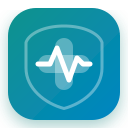

<p align="center">
  
</p>

<p align="center">
  <b>Personal & Family Medical Vault with Local-First AI Analysis</b>
</p>

<p align="center">
  
  <a href="LICENSE"></a>
  
  
  
</p>

---

## 🩺 Overview

**MedBuddy** is a secure, local-first desktop application designed to organize, catalog, and analyze your entire family's medical records. From messy lab PDFs and physical doctor prescriptions to hospital discharge summaries and radiology scans, MedBuddy turns scattered health documents into structured, searchable health profiles, interactive conversational consultations, and longitudinal timelines.

Built with a **privacy-first architecture**, all sensitive documents, profiles, and SQLite databases remain strictly on your local machine. When analyzing reports or querying medical records, you have complete control over whether processing stays **100% offline** (via local LLMs like Ollama or LM Studio) or connects via **BYOK** (Bring Your Own Key) to leading cloud providers.

---

## 🖥️ Platform Availability & Downloads

> **Yes! Because MedBuddy is built on Electron, it is officially supported across Windows, macOS, and Linux.**

Prebuilt, ready-to-run installation packages and standalone bundles are published with every release. Download the appropriate binary for your system from the **[GitHub Releases](https://github.com/medbuddy/medbuddy/releases)** page:

| Operating System | Supported Architectures | Available Package Formats | Notes |
| :--- | :--- | :--- | :--- |
| **Windows** | `x64`, `arm64` | `.exe` (NSIS Installer), `.exe` (Portable) | Windows 10 & 11 supported |
| **macOS** | Apple Silicon (`arm64`), Intel (`x64`) | `.dmg`, `.zip` (Universal & Native) | macOS 11+ (Big Sur through Sequoia) |
| **Linux** | `x64`, `arm64` | `.AppImage`, `.deb`, `.rpm` | Ubuntu, Debian, Fedora, Arch, and derivatives |

---

## ✨ Key Features

- **👨‍👩‍👧‍👦 Multi-Profile Family Vault**: Manage discrete records for yourself, children, and elderly parents under segregated profiles with custom avatars, dates of birth, and health notes.
- **💬 Profile-Scoped Document Chat & Local RAG**: Interactively chat with medical records powered by local LLMs (Ollama, LM Studio, vLLM) or BYOK cloud models. Features strict SQL-level profile isolation (zero cross-profile data leakage), SQLite FTS5 BM25 retrieval across chunked records, in-input profile scoping pills, `@mention` autocomplete, collapsible chain-of-thought reasoning drawer, and clickable page-level source citations.
- **📁 Nested Folders & Smart AI File Organizer**: Hierarchical folder system (e.g., `Mom → Cardiology → 2024`) with an automated **Document Organizer & Renamer**. Offers both instant heuristic (<10ms) and AI-assisted batch classification to standardize filenames (`<Prefix-ReportName>-<Date>.<ext>`) across 12 clinical prefixes (Bloodwork, CT, MRI, Ultrasound, Pathology, Prescriptions, etc.) and assign clinical tags.
- **🔍 Two-Stage OCR Pipeline with Vision Fallback**: Embedded **PaddleOCR** (PP-OCRv4 via ONNX Runtime & Canvas) extracts text completely offline from scans and multi-page PDFs. Degraded scans or complex handwriting automatically fall back to **Multimodal/Vision LLM** transcription, backed by an async background queue with crash recovery and live page progress badges.
- **👁️ Split-Screen Document Preview**: Side-by-side drawer to inspect original PDF/image documents alongside extracted OCR text, file metadata, and a one-click shortcut to launch a targeted Chat consultation on the document.
- **🧠 Flexible Dual-Engine AI (Local vs. BYOK Cloud)**:
  - **100% Local / Offline**: Native presets for **LM Studio** (`localhost:1234`), **Ollama** (`localhost:11434`), **vLLM** (`localhost:8000`), or any custom OpenAI-compatible server (LocalAI, llama.cpp).
  - **BYOK Cloud Providers**: Built-in support with key-prefix auto-detection for **OpenAI**, **OpenRouter**, **Groq**, and custom cloud endpoints with live latency diagnostics and visible provenance pills.
- **📊 Structured Clinical Dashboards & Anomaly Detection**: Automatically extracts discrete biomarkers with visual reference-range bars (Normal/Borderline/Flagged), detects cross-record clinical anomalies (discrepancies, sharp trends, missing follow-ups), generates plain-language summaries, and synthesizes prioritized physician discussion points.
- **📈 Longitudinal Health Timeline & Biomarker Sparklines**: Interactive Health Chronicle tracking events across years with zoom ranges (3m, 6m, 1y, All), category filters, event search, and dedicated biomarker focus mode featuring trajectory sparklines.
- **⚡ Zero-Cost History Caching**: All generated clinical analyses are cached locally via deterministic content hashing (`sha256`). Revisit any past dashboard instantly without re-processing files or incurring API costs.
- **💾 Local & Cloud-Synced Vault Backup / Restore**: Export or restore your entire vault or specific profiles/folders to any local directory or cloud-synced folder (Google Drive, Dropbox, OneDrive, iCloud) with JSON state snapshots and SHA256 integrity validation.
- **📤 Export & Share**: One-click export of any generated health dashboard or timeline summary to PDF or image to bring to clinical consultations.
- **🩺 Clinical Command Dashboard & Diagnostics Logs**: Dedicated home dashboard summarizing family profiles, recent reports, and quick actions, plus an in-app operational log viewer (`Ctrl+L` / `⌘L`) for real-time extraction and AI pipeline diagnostics.
- **🎨 Refined Modern Interface & Shortcuts**: Dark and light modes inspired by modern productivity tools, complete with keyboard shortcuts (`Ctrl+B` toggle sidebar, `Ctrl+4` chat, `Ctrl+L` diagnostics, `Esc` dismiss drawers) and connection health diagnostics.

---

## 🎯 Primary Use Cases

### 1. Multi-Generational Family Caregiving
Keep vaccination logs, pediatrician visits, and growth charts for your kids alongside chronic prescription histories, cardiologist notes, and annual bloodwork for aging parents.

### 2. Pre-Appointment Doctor Preparation
Before visiting a specialist, select all reports from the last 12 months and run a synthesis. Walk into the examination room with an organized summary of key trends and AI-suggested questions tailored to your recent lab results.

### 3. Tracking Chronic Trends Over Time
Track key indicators such as **HbA1c**, **Lipid Profiles (LDL/HDL)**, **Thyroid (TSH)**, or **Kidney Function (Creatinine/eGFR)** over years, even when tests were performed across different hospitals with differing lab formats.

### 4. Interactive Record Consultation & Medication Inquiries
Ask natural language questions like *"What was Dad's PSA trend between 2023 and 2024?"* or *"What dosage of Atorvastatin was prescribed?"* and get streaming answers grounded strictly in the target profile's documents, accompanied by page-level citations and previews.

### 5. Emergency Preparedness & Travel
Carry a completely offline, searchable medical history on your laptop during travel without relying on internet access or hospital patient portals.

---

## 🏗️ Architecture

```
┌────────────────────────────────────────────────────────┐
│                   MedBuddy Desktop                     │
│                                                        │
│  ┌──────────────────────────────────────────────────┐  │
│  │     React 18 + TailwindCSS + Lucide UI           │  │
│  │     (Dashboard, Chat Assistant, Timeline, OCR)   │  │
│  └────────────────────────┬─────────────────────────┘  │
│                           │ IPC Bridge                 │
│  ┌────────────────────────▼─────────────────────────┐  │
│  │                Electron Main Process             │  │
│  │  ┌─────────────────────────────────────────────┐ │  │
│  │  │ Local SQLite Engine (better-sqlite3 + FTS5) │ │  │
│  │  │ Documents, Chunks, Chat Sessions, Overviews │ │  │
│  │  └─────────────────────────────────────────────┘ │  │
│  │  ┌─────────────────────────────────────────────┐ │  │
│  │  │ Local OCR Engine (ONNX + PaddleOCR + Canvas)│ │  │
│  │  └─────────────────────────────────────────────┘ │  │
│  │  ┌─────────────────────────────────────────────┐ │  │
│  │  │ AI & RAG Orchestrator (Ollama / LM Studio)  │ │  │
│  │  └─────────────────────────────────────────────┘ │  │
│  └──────────────────────────────────────────────────┘  │
└────────────────────────────────────────────────────────┘
```

---

## 🚀 Getting Started (Users)

1. Download the latest installer for your operating system from **[Releases](https://github.com/medbuddy/medbuddy/releases)**:
   - **Windows**: Run `MedBuddy-Setup-x.x.x.exe` or use the portable version.
   - **macOS**: Open `MedBuddy-x.x.x.dmg` and drag MedBuddy into your `Applications` folder.
   - **Linux**: Make the `.AppImage` executable (`chmod +x MedBuddy-*.AppImage`) and run it, or install the `.deb`/`.rpm` package.
2. Launch MedBuddy and create your first family member profile.
3. Drop medical records (PDFs, scanned images) into folders.
4. *(Optional)* Configure your AI engine in **Settings → AI Provider**:
   - **Local Inference**: Native presets for **LM Studio** (`localhost:1234`), **Ollama** (`localhost:11434`), or **vLLM** (`localhost:8000`).
   - **Cloud BYOK**: Enter your API key for **OpenAI**, **OpenRouter**, or **Groq** (automatically detected from key prefix).
5. Click **Organize** on any folder or selection to preview and batch-standardize messy scan filenames into structured clinical names and tags.
6. Click **Analyze** on any file or folder to generate your first medical overview with biomarker range bars and clinical anomaly flags.
7. Open **Chat with MedBuddy** (`Ctrl+4` / `⌘4`) to ask questions across any family profile's records with in-input `@mentions`, starter prompt chips, and verified document citations.
8. Switch to the **Health Timeline** to visualize longitudinal biomarker sparklines and track health events over years.

---

## 💻 Developer Setup & Local Build

If you want to contribute, modify, or build MedBuddy from source:

### Prerequisites

- **Node.js**: `v20.x` or higher (LTS recommended)
- **npm**: `v10.x` or higher
- **Native Build Toolchain**:
  - **Linux**: `libcairo2-dev`, `libpango1.0-dev`, `libpixman-1-dev`, `build-essential`
    ```bash
    sudo apt-get install -y build-essential libcairo2-dev libpango1.0-dev libpixman-1-dev libjpeg-dev libgif-dev librsvg2-dev
    ```
  - **macOS**: Xcode Command Line Tools (`xcode-select --install`)
  - **Windows**: Visual Studio C++ Build Tools or `windows-build-tools`

### 1. Clone the Repository

```bash
git clone https://github.com/medbuddy/medbuddy.git
cd medbuddy
```

### 2. Install Dependencies

```bash
npm install
```

### 3. Run Development Server

Launches Vite with Hot Module Replacement (HMR) and Electron in development mode:

```bash
npm run dev
```

### 4. Run Automated Test Suites

Executes integration, database sync, profile-scoped chat RAG (`test/chat.test.ts`), folder organization, and timeline unit tests:

```bash
npm test
```

### 5. Compile & Build

```bash
npm run build
```

---

## 📦 Packaging & Release Builds

MedBuddy includes native packaging configurations for all three major desktop platforms.

### Building Locally for Your Host OS

To package an installer or standalone binary for your current operating system:

```bash
# Package for host platform
npm run dist

# Or specify a target platform directly
npx electron-builder --win      # Windows (.exe)
npx electron-builder --mac      # macOS (.dmg, .zip)
npx electron-builder --linux    # Linux (.AppImage, .deb)
```

The output installers and binaries will be generated in the `release/` folder.

### Automated Multi-Platform GitHub Actions CI/CD

MedBuddy includes an automated workflow at `.github/workflows/release.yml`. When you publish a release or push a git version tag:

```bash
git tag v1.0.0
git push origin v1.0.0
```

GitHub Actions will automatically spin up native build runners across **Windows**, **macOS**, and **Ubuntu Linux**, compile the native modules (`better-sqlite3`, `canvas`, `onnxruntime-node`), package the release installers, and attach them directly to the GitHub Release.

---

## 🔒 Privacy & Security

- **Local Storage by Default**: Your documents, parsed text, and health history remain on your machine in an isolated SQLite database.
- **Strict Profile Isolation**: SQL query-level scoping prevents cross-profile medical data leakage during search and document chat.
- **Zero Telemetry**: No third-party usage trackers, external analytics, or remote logging.
- **Explicit Cloud Boundaries**: Cloud models and cloud backups are strictly opt-in. The UI always displays whether a requested action will communicate with an external API.

---

## ⚠️ Medical Disclaimer

**MedBuddy is an informational and personal document management tool. It does not provide medical advice, diagnosis, or clinical treatment recommendations.** 

The summaries, metric extractions, and questions generated by AI are for personal record organization only. Always consult a qualified physician or healthcare provider regarding any medical condition or treatment plan. Never disregard professional clinical advice based on output from MedBuddy.

---

## 📄 License

This project is licensed under the [GNU General Public License v3.0 (GPL-3.0)](LICENSE).
