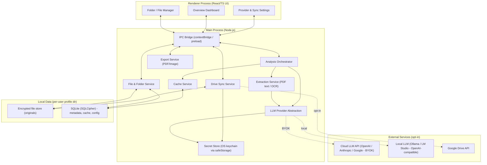
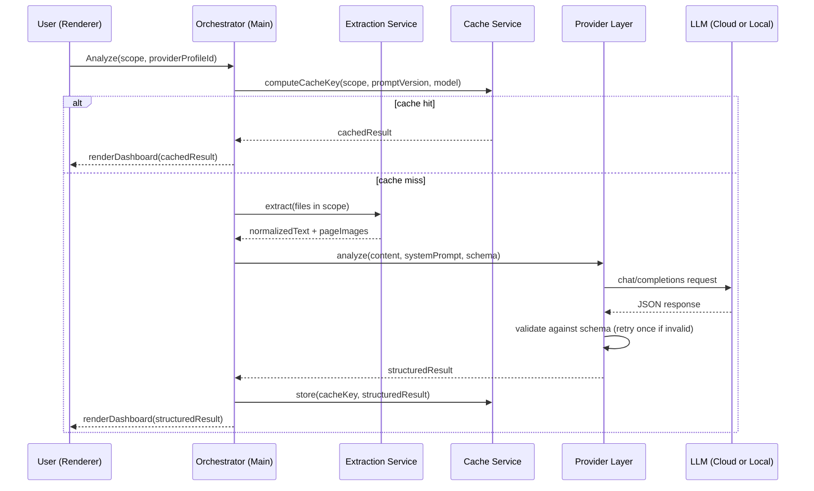
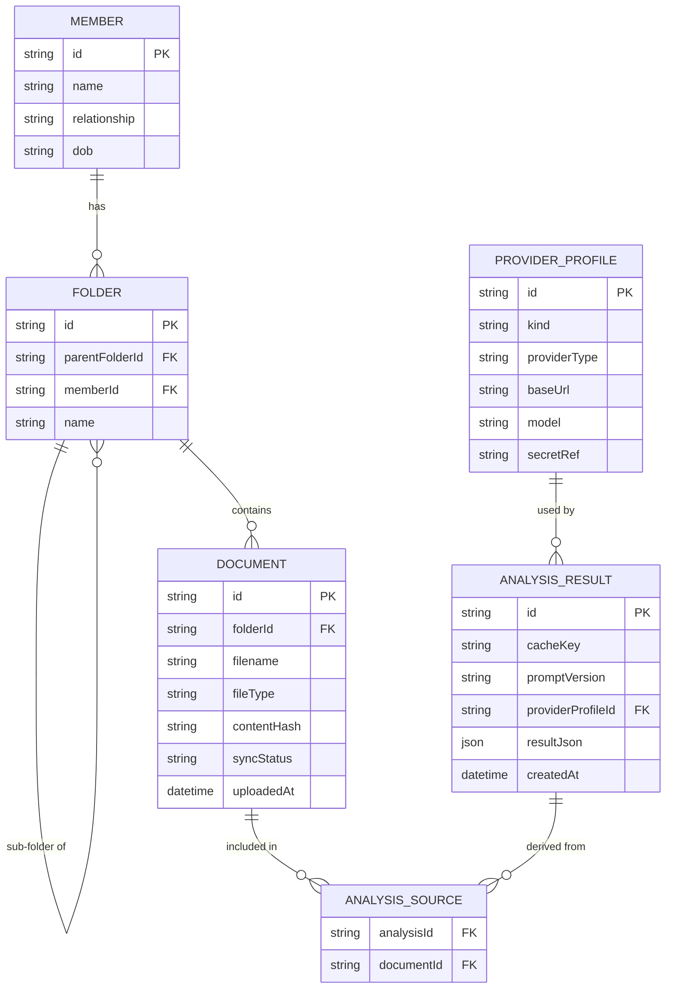

# PRD: Family Medical Vault (working title)
**A local-first Electron app for organizing family medical records with AI-powered analysis**

| | |
|---|---|
| **Status** | Draft v1.0 |
| **Owner** | Product/Eng (TBD) |
| **Last updated** | September 22, 2026 |
| **Doc type** | Technical PRD |

---

## 1. Summary

A desktop app (Electron) that lets a user organize medical documents (PDFs, images, scans) into folders per family member, run AI-driven analysis on demand (via a BYOK cloud LLM or a local model through Ollama/LM Studio), and view the results as a structured, visual "health overview" dashboard. Every generated overview is cached and browsable later. Overviews can be exported as PDF/image. Users can optionally sync their local files to Google Drive.

The core design tension driving most technical decisions: **this is sensitive personal health data, stored locally by default**, with cloud touchpoints (BYOK LLM calls, Drive sync) that must be explicit, opt-in, and clearly communicated.

---

## 2. Goals

- Organize medical documents hierarchically: **Family Member → Folder → Sub-folder → Files**.
- Let users trigger AI analysis on a single file, multiple selected files, or an entire folder (recursively).
- Support two AI execution modes, switchable per-analysis:
  - **BYOK**: user's own API key against a cloud provider (OpenAI, Anthropic, Google, etc.)
  - **Local**: user's own model served via Ollama or LM Studio (OpenAI-compatible endpoints).
- Return analysis as a **validated structured JSON object**, rendered as a visual dashboard (summary, key metrics, flags, trends).
- **Cache** every generated overview and expose a library/history view to revisit them without re-running the model.
- **Export** any overview to PDF or image.
- Optional **Google Drive sync** for backup/cross-device access, off by default, encrypted in transit and (ideally) at rest.

## 3. Non-goals (v1)

- Not a diagnostic or clinical decision-support tool — outputs are informational summaries, not medical advice (needs explicit disclaimer in UI and system prompt).
- No multi-user/shared accounts, server backend, or real-time collaboration.
- No EHR/FHIR integration in v1 (possible later).
- No mobile app in v1.
- Not HIPAA-certified software; it's a personal tool. (Still built with HIPAA-grade security hygiene, since the data class is the same.)

---

## 4. Users & core use cases

- A person managing their own health records plus aging parents' and kids' records.
- Someone consolidating scattered lab reports/scans before a doctor's visit and wanting a plain-language summary.
- A caregiver tracking trends over time (e.g., a metric drifting out of range across several years of bloodwork).

**Representative user stories**
1. As a user, I create a folder for "Mom", with sub-folders "Bloodwork" and "Cardiology", and drop in PDFs/photos of reports.
2. As a user, I select the "Bloodwork" sub-folder and click "Analyze" — I get a dashboard summarizing all reports in it, flagging out-of-range values and trends.
3. As a user, I configure my own OpenAI key once, and separately point the app at a local Llama model running in LM Studio, and choose per-analysis which to use.
4. As a user, I revisit "Overviews" later and open a previously generated dashboard instantly (no re-analysis, no cost).
5. As a user, I export an overview as a PDF to bring to a doctor's appointment.
6. As a user, I turn on Google Drive sync so my files are backed up, understanding what that means for privacy.

---

## 5. Functional requirements

### 5.1 Family/folder/file management
- CRUD for **Members** (name, relationship label, optional avatar/DOB — DOB is useful for age-relative reference ranges later).
- Arbitrary nested **folders** under a member (e.g., Member → "Bloodwork" → "2024" → "March").
- Drag-and-drop or file-picker import of PDFs and images (JPEG/PNG/HEIC/TIFF) into any folder.
- Basic file ops: rename, move, delete (soft-delete/trash with recovery window), multi-select.
- File preview pane (PDF viewer, image viewer) without leaving the app.

### 5.2 AI provider configuration (BYOK + local)
- Settings screen to add one or more **provider profiles**:
  - Cloud (BYOK): provider type (OpenAI/Anthropic/Google/other OpenAI-compatible), API key, model name, optional org/project ID.
  - Local: base URL (default `http://localhost:11434` for Ollama, `http://localhost:1234/v1` for LM Studio), model name, optional API key if the local server requires one.
- "Test connection" action per profile.
- API keys are **never stored in plaintext**; see §8.
- A default profile can be set, but the user picks the profile per analysis run (so cost/privacy trade-off is a conscious choice each time, not a hidden default).
- Clear, persistent UI indicator distinguishing "this analysis will call an external API" vs. "this stays on your machine."

### 5.3 Analysis trigger & scope
- "Analyze" action available on: a single file, a multi-file selection, or a folder (with a toggle for "include sub-folders").
- Before running, show: which files are included, estimated token/cost impact (cloud only), and which provider will be used.
- Support re-running an analysis on the same scope (e.g., after adding a new report) — this creates a new versioned overview rather than silently overwriting the old one.

### 5.4 Extraction & analysis pipeline
- Text-native PDFs: extract text directly.
- Scanned PDFs/images: OCR fallback (local OCR engine) when the chosen model isn't multimodal; multimodal-capable providers (vision-enabled cloud or local models) can receive page images directly instead.
- Multi-document runs: extracted content is assembled with document boundaries/metadata (filename, date if detectable) preserved, then chunked as needed to fit the model's context window, with a merge/reduce step for cross-document synthesis.
- A structured **system prompt** (versioned, editable by advanced users in Settings) instructs the model to:
  - Extract discrete data points (test names, values, units, reference ranges, dates).
  - Identify flags/out-of-range results.
  - Summarize findings in plain language.
  - Note trends if multiple dated documents are present.
  - Return **only** a JSON object matching a fixed schema (see §9).
- Response is validated against the schema (e.g., with Zod/AJV); on validation failure, retry once with a corrective follow-up prompt before surfacing an error to the user.

### 5.5 Caching & overview history
- Every successful analysis is cached and listed in an **"Overviews"** section, independent of the source folder view.
- Cache key = hash of (sorted file content hashes + prompt version + provider/model identifier).
- If a user re-opens a folder whose contents and prompt/model haven't changed since the last run, the app surfaces the cached overview instead of prompting to re-run (with a visible "Regenerate" option).
- Overview history is versioned per scope, so users can compare "Bloodwork analysis — March" vs. "— June."

### 5.6 Dashboard / visualization
- Renders the structured JSON into:
  - A top-line **summary card** (plain-language overview).
  - **Key metrics** as cards/chips with status coloring (normal/borderline/flagged).
  - A **trends** section (line charts) when multiple dated data points exist for the same metric across documents.
  - A **flags/attention** list.
  - Source traceability: each extracted data point links back to its source document/page.
- Dashboard is a saved artifact tied to the cached overview — reopening it doesn't require network/model access.

### 5.7 Export
- Export the current overview to **PDF** and to **PNG/JPEG**, preserving the visual layout (not just raw JSON).
- Print-friendly layout variant (single column, no interactive-only elements).

### 5.8 Google Drive sync (optional)
- OAuth 2.0 (with PKCE) sign-in to Google; scope limited to `drive.file` (app only accesses files/folders it creates — not the user's whole Drive).
- User opts in **per member or globally**; sync mirrors the local folder structure into an app-specific Drive folder.
- Sync direction is primarily local → cloud backup; pulling from another device is a stretch goal (v2), since conflict resolution multiplies complexity.
- Clear setting to **encrypt files client-side before upload** (recommended default: on) so Drive only ever stores ciphertext.
- Sync status indicators per file/folder (synced, pending, error, conflict).

---

## 6. Non-functional requirements

| Category | Requirement |
|---|---|
| Privacy | No document content or extracted data leaves the device except (a) to the LLM provider the user explicitly selected for that run, and (b) to Google Drive if sync is explicitly enabled. No telemetry on document content, ever. |
| Security | Encryption at rest for the local store; OS-native secret storage for API keys/tokens; optional app-lock (PIN/OS biometrics) before the app shows any content. |
| Performance | Folder-level analysis on ~20 typical reports should extract+chunk in the background without blocking the UI; cached overviews open instantly (<300ms). |
| Reliability | Works fully offline for local-LLM mode and for browsing/viewing already-cached overviews. |
| Portability | Windows, macOS, Linux (standard Electron target matrix). |
| Extensibility | Provider layer and system prompt are pluggable/versioned so new LLM providers or schema versions don't require a rewrite. |

---

## 7. System architecture

### 7.1 High-level component diagram



**Notes:**
- All model calls and Drive calls happen in the **main process**, never the renderer, so credentials and raw file bytes never pass through renderer-accessible/dev-tools-visible contexts.
- `contextBridge` exposes a narrow, typed IPC API to the renderer — no raw Node/fs access in renderer.

### 7.2 Analysis pipeline sequence



### 7.3 Provider abstraction

A single interface normalizes all providers, since Ollama and LM Studio both expose **OpenAI-compatible** `/v1/chat/completions`-style endpoints, and cloud BYOK providers largely follow similar (if not identical) chat-completion shapes:

```ts
interface LLMProvider {
  id: string;                       // profile id
  kind: "cloud" | "local";
  supportsVision: boolean;
  analyze(input: {
    documents: ExtractedDocument[]; // text + optional page images
    systemPrompt: string;
    responseSchema: JSONSchema;
  }): Promise<StructuredAnalysisResult>;
  testConnection(): Promise<boolean>;
}
```

Concrete adapters: `OpenAIProvider`, `AnthropicProvider`, `GoogleProvider` (cloud/BYOK), and a shared `OpenAICompatibleProvider` used for both Ollama and LM Studio (they differ only in base URL/default port and minor request quirks). This keeps adding a new OpenAI-compatible local server to a config change, not new code.

### 7.4 Local data model



Metadata lives in **SQLite** (SQLCipher-encrypted). Original files live on disk under the app's user-data directory, encrypted at rest (see §8). Nothing here requires a server component.

---

## 8. Security & privacy (detail)

Given the data class (medical documents), this section is load-bearing, not boilerplate:

- **API keys & tokens**: stored via Electron's `safeStorage` (backed by OS keychain — Keychain on macOS, DPAPI on Windows, libsecret on Linux). Never written to plaintext config files, never logged.
- **Files at rest**: encrypt the file store with a per-install key (also OS-keychain-backed), or optionally a user-set passphrase for an extra layer (trade-off: forgotten passphrase = unrecoverable data, must be surfaced clearly).
- **Metadata DB**: SQLCipher (encrypted SQLite) rather than plain SQLite.
- **In transit**: TLS to any cloud endpoint; local LLM calls to `localhost` are still worth constraining to loopback-only to avoid accidental LAN exposure.
- **Cloud LLM calls (BYOK)**: the app should never silently default to a cloud provider. Every run shows which provider is about to be used before sending data. Consider a "redact identifiers before sending" pre-processing option as a v2 enhancement (strip names/MRNs from extracted text before it leaves the device), especially valuable for cloud runs.
- **Google Drive sync**: `drive.file` scope only (least privilege — the app can't browse the rest of the user's Drive). Client-side encryption before upload should be the recommended default, with a clear warning if the user disables it ("Drive will store readable copies of your family's medical files").
- **App lock**: optional PIN/OS-biometric gate on app launch, with an auto-lock timeout.
- **No content telemetry**: crash/usage analytics, if any, must be structurally incapable of including document content, extracted health data, or analysis results.
- **Legal/UX disclaimer**: persistent, unavoidable messaging that outputs are informational, not medical advice, and that the user is responsible for their own API key usage/costs and for choosing what data leaves their device.

---

## 9. Structured output schema (example)

This is the contract between the LLM response and the dashboard renderer. Versioned (`schemaVersion`) so the UI can handle older cached results gracefully after schema changes.

```json
{
  "schemaVersion": "1.0",
  "summary": "Plain-language overview of what these documents show, 2-4 sentences.",
  "documentDateRange": { "earliest": "2023-01-10", "latest": "2024-06-02" },
  "metrics": [
    {
      "name": "LDL Cholesterol",
      "value": 142,
      "unit": "mg/dL",
      "referenceRange": "0-99",
      "status": "flagged",
      "history": [
        { "date": "2023-01-10", "value": 118 },
        { "date": "2024-06-02", "value": 142 }
      ],
      "sourceDocumentIds": ["doc_abc123"]
    }
  ],
  "flags": [
    {
      "title": "LDL trending upward",
      "severity": "moderate",
      "explanation": "LDL rose from 118 to 142 mg/dL over 17 months, now above reference range.",
      "relatedMetric": "LDL Cholesterol"
    }
  ],
  "recommendations": [
    "Discuss LDL trend with a physician at the next visit."
  ],
  "extractedEntities": {
    "reportTypes": ["Lipid Panel"],
    "providers": ["Example Diagnostics Lab"]
  },
  "sourceDocuments": [
    { "id": "doc_abc123", "filename": "bloodwork_2024-06-02.pdf" }
  ],
  "confidence": "high"
}
```

The system prompt should instruct the model to omit fields it has no evidence for rather than guessing, and the validator should treat missing optional fields as acceptable but reject fabricated-looking structural violations (e.g., non-numeric `value` where numeric is expected).

---

## 10. Suggested tech stack

| Layer | Choice | Why |
|---|---|---|
| Shell | Electron | Cross-platform desktop, direct fs access, native keychain integration |
| UI | React + TypeScript | Standard, large ecosystem for dashboards |
| Charts | Recharts or D3 | Trend lines, metric visualizations |
| Local DB | SQLite + SQLCipher (better-sqlite3 + cipher build) | Encrypted, embedded, no server |
| PDF text extraction | pdf.js / pdf-parse | Mature, embeddable |
| OCR (fallback) | Tesseract.js (or a local vision model when available) | Works offline |
| Secret storage | Electron `safeStorage` (+ OS keychain) | No plaintext secrets |
| Cloud LLM SDKs | Official SDKs (OpenAI, Anthropic, Google) behind the provider interface | Maintained, typed |
| Local LLM | Ollama / LM Studio via OpenAI-compatible REST | User already controls these; no bundling of model weights |
| PDF/Image export | Electron `webContents.printToPDF` + `capturePage`, or `html2canvas`/`jsPDF` in renderer | Native, reliable |
| Drive sync | Google Drive API v3, OAuth2 + PKCE, `drive.file` scope | Least-privilege cloud access |
| Schema validation | Zod or Ajv | Enforce structured LLM output |

---

## 11. Phased roadmap

| Phase | Scope |
|---|---|
| **MVP** | Member/folder/file management, single BYOK cloud provider, single-document and folder-level analysis, structured dashboard, overview history/cache, PDF/image export |
| **V2** | Local LLM support (Ollama/LM Studio adapter), multi-provider profiles, OCR for scanned documents, Google Drive sync (upload-only, client-side encryption) |
| **V3** | Bi-directional Drive sync with conflict handling, redact-before-send option for cloud calls, app-lock/biometrics, cross-analysis trend view across a member's entire history, editable/custom system prompts per analysis type |

---

## 12. Open questions

1. Should local-LLM analyses run fully synchronously in the UI, or always as a background job with a progress/notification model (matters more once folder-level batches get large)?
2. For BYOK, do we support arbitrary OpenAI-compatible endpoints generically (so any provider "just works"), or maintain a curated adapter list for better error handling per provider?
3. What's the failure/UX behavior when a local model can't produce valid structured JSON after retry — show raw text with a warning, or hard-fail?
4. How much of the reference-range/flagging logic should be delegated to the LLM vs. a deterministic post-processing rule set (LLM judgment can be inconsistent on borderline values)?
5. Should Drive sync be per-member (so a user could sync only some family members' folders) — likely yes, but affects the sync-state data model in §7.4.

---

## 13. Success metrics (suggested)

- Time from "drop in reports" to "readable dashboard" for a typical folder (target: under prompt-provider latency + a few seconds of local processing).
- % of analyses that pass schema validation on first try (proxy for prompt/schema quality).
- Cache hit rate on repeat folder views (proxy for whether caching is actually saving cost/time as intended).
- % of users who configure a local provider vs. BYOK only (signals how much the local-LLM path matters in practice).
