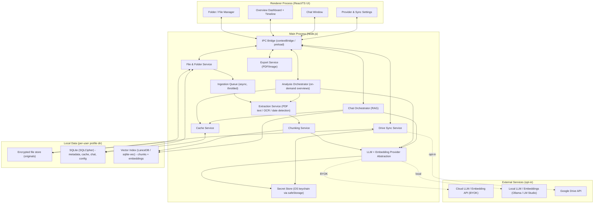
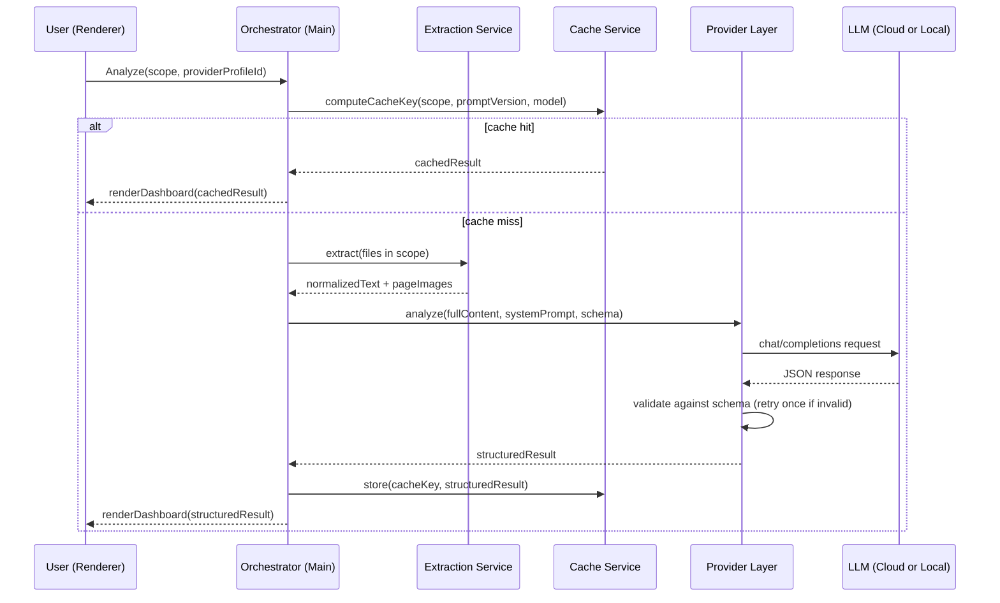
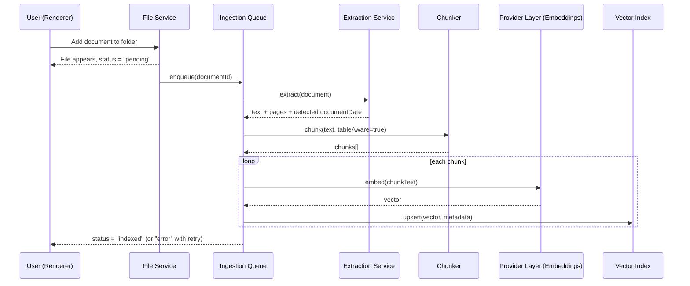
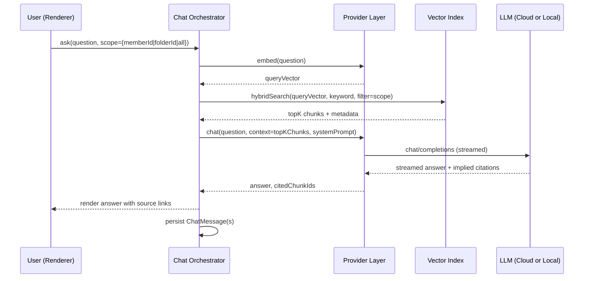
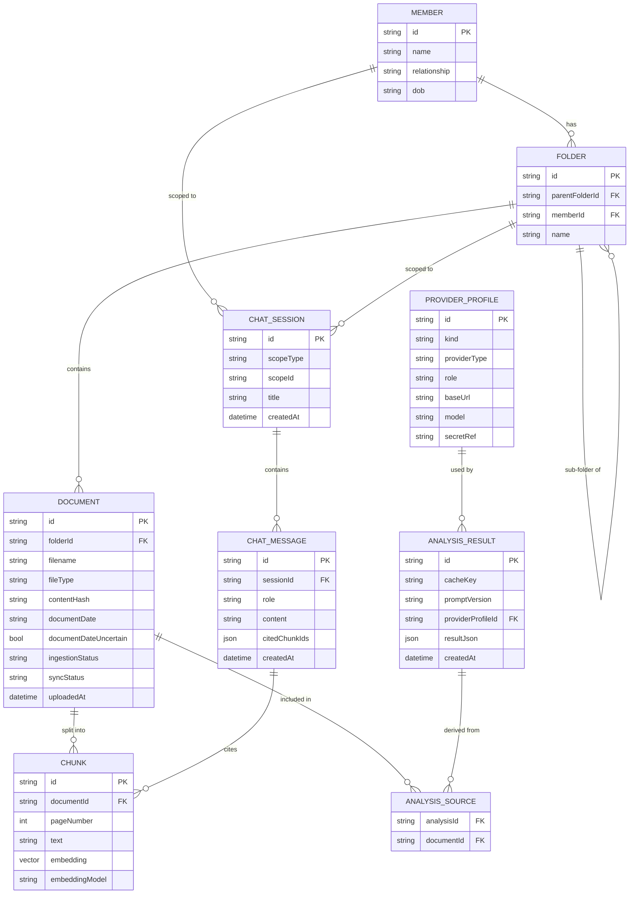

# PRD: Family Medical Vault (working title)
**A local-first Electron app for organizing family medical records, with an AI knowledge base, on-demand overviews, and conversational Q&A**

| | |
|---|---|
| **Status** | Draft v1.1 |
| **Owner** | Product/Eng (TBD) |
| **Last updated** | September 22, 2026 |
| **Doc type** | Technical PRD |

---

## 1. Summary

A desktop app (Electron) that lets a user organize medical documents (PDFs, images, scans) into folders per family member, and get two complementary ways to make sense of them:

1. **On-demand structured overviews** — select a file, selection, or folder and generate a visual dashboard (summary, metrics, flags, trends) via a BYOK cloud LLM or a local model (Ollama/LM Studio).
2. **An always-on knowledge base with a chat interface** — every document is asynchronously extracted, chunked, and embedded into a local vector store the moment it's added, so the user can later ask free-form questions ("what was Mom's blood pressure trend in 2023?") scoped to a person, a folder, or everything, with cited sources.

Both are layered on the same extraction pipeline; the difference is **bounded, full-context analysis** (overview generation) vs. **retrieval-augmented, open-ended Q&A** (chat) — see §7 for why they're architected differently.

Every generated overview is cached and browsable later, with an interactive chronological timeline of a person's documents and flagged events. Overviews export to PDF/image. Google Drive sync remains optional and opt-in.

The core design tension driving most technical decisions is unchanged: **this is sensitive personal health data, stored locally by default**, with cloud touchpoints (BYOK LLM/embedding calls, Drive sync) that must be explicit and opt-in.

---

## 2. Goals

- Organize medical documents hierarchically: **Family Member → Folder → Sub-folder → Files**.
- **Automatically and asynchronously ingest** every added document into a local knowledge base (extract → chunk → embed → index) without blocking the UI.
- Let users trigger **structured AI overviews** on a file, selection, or folder (BYOK or local model).
- Let users **chat** with an AI agent scoped to a person, a folder, or the whole vault, grounded in the ingested knowledge base with source citations.
- Render overviews as a visual dashboard including an **interactive chronological timeline** of documents and findings.
- **Cache** every generated overview and chat session; both are revisitable without re-processing.
- **Export** any overview (including a flattened, static version of the timeline) to PDF or image.
- Optional **Google Drive sync**, off by default, encrypted in transit and ideally at rest.

## 3. Non-goals (v1)

- Not a diagnostic or clinical decision-support tool — both overviews and chat answers are informational, not medical advice.
- The chat agent does not act as a general medical chatbot beyond what's in the user's own documents — it should decline or clearly flag when a question can't be answered from the knowledge base rather than falling back to open medical speculation.
- No multi-user/shared accounts, server backend, or real-time collaboration.
- No EHR/FHIR integration in v1.
- No mobile app in v1.
- Not HIPAA-certified software; built with HIPAA-grade security hygiene given the data class, but it's a personal tool, not a covered entity's system.

---

## 4. Users & core use cases

- A person managing their own health records plus aging parents' and kids' records.
- Someone consolidating scattered lab reports/scans before a doctor's visit and wanting a plain-language summary.
- A caregiver tracking trends over time (e.g., a metric drifting out of range across years of bloodwork).

**Representative user stories**
1. As a user, I create a folder for "Mom" with sub-folders "Bloodwork" and "Cardiology," and drop in PDFs/photos of reports. Each file is picked up and indexed in the background — I see a small "processing → indexed" status per file, not a blocking spinner.
2. As a user, I select the "Bloodwork" sub-folder and click "Analyze" — I get a dashboard summarizing all reports in it, with flags and trends.
3. As a user, I open a chat scoped to "Mom" and ask, "Has her cholesterol always been high, or is this new?" — the agent answers using only her documents and shows which reports it pulled from.
4. As a user, I look at Mom's overview and see a horizontal timeline of all her documents; hovering over "March 2024" shows the two reports uploaded that month and any flags raised at the time.
5. As a user, I revisit "Overviews" later and open a previously generated dashboard instantly — no re-analysis, no cost, chat history is there too.
6. As a user, I export an overview (including a static rendering of the timeline) as a PDF to bring to a doctor's appointment.
7. As a user, I configure a local embedding model in Ollama so indexing never leaves my machine, while still using a cloud model occasionally for a one-off deep analysis.

---

## 5. Functional requirements

### 5.1 Family/folder/file management
- CRUD for **Members** (name, relationship label, optional avatar/DOB).
- Arbitrary nested **folders** under a member.
- Drag-and-drop or file-picker import of PDFs and images (JPEG/PNG/HEIC/TIFF) into any folder.
- Basic file ops: rename, move, delete (soft-delete/trash with recovery), multi-select.
- File preview pane (PDF viewer, image viewer) in-app.

### 5.2 AI provider configuration (BYOK + local)
- Settings screen to add one or more **completion provider profiles** (cloud BYOK: OpenAI/Anthropic/Google/other OpenAI-compatible; local: Ollama/LM Studio via base URL).
- A **separate embedding provider profile**, configured independently — not every completion provider offers embeddings (e.g., a user might chat with Claude but embed locally via Ollama's `nomic-embed-text`, or embed via OpenAI while chatting locally). The app should not assume the same provider does both.
- "Test connection" per profile, for both completion and embedding endpoints.
- API keys are never stored in plaintext (§8).
- Persistent, clear UI indication of whether a given action (overview, chat turn, indexing) is about to call an external API or stay local.

### 5.3 On-demand analysis trigger & scope
- "Analyze" available on a single file, a multi-file selection, or a folder (with "include sub-folders").
- Shows included files, estimated cost impact (cloud only), and which provider will run before executing.
- Re-running creates a new versioned overview rather than overwriting the previous one.

### 5.4 Extraction (shared by overviews and ingestion)
- Text-native PDFs: direct text extraction.
- Scanned PDFs/images: OCR fallback when the chosen model isn't multimodal; multimodal-capable models can receive page images directly.
- Extraction output (normalized text + page images + detected structure) is reused by both the on-demand analysis pipeline and the async ingestion pipeline below, so text isn't extracted twice per document.

### 5.5 Asynchronous knowledge-base ingestion (RAG)
- The moment a document is added to any folder, it's queued for background processing — **no user action required**:
  1. Extract (§5.4).
  2. Attempt lightweight **document date detection** (report date, not upload date) via heuristics/regex first, LLM-assisted extraction as a fallback; store as `documentDate` with a "date uncertain" flag if unresolved (falls back to `uploadedAt`).
  3. **Chunk** the extracted text (target ~500–800 tokens, ~10–15% overlap; table-aware so a lab panel's rows aren't split mid-table across chunks).
  4. **Embed** each chunk via the configured embedding provider.
  5. Write chunk text + embedding + metadata (documentId, memberId, folderId, page, documentDate) to the local vector index.
  6. Update the document's `ingestionStatus` (`pending → processing → indexed | error`), visible as a small badge in the file list.
- Processing is throttled/queued (concurrency limit) to avoid saturating a local model server or hitting cloud rate limits; failed items retry with backoff and surface a per-file error state rather than failing silently.
- Re-ingestion is triggered if a document is replaced/edited, or if the user switches embedding provider/model (see open questions on re-indexing cost).

### 5.6 Structured analysis pipeline (on-demand overviews)
- A versioned, editable **system prompt** instructs the model to extract data points, flag out-of-range results, summarize in plain language, note trends across dated documents, and return **only** JSON matching the schema in §9.
- For a single folder's worth of documents, this pipeline uses the **full extracted text** of the documents in scope (not retrieval) — bounded scope, so completeness matters more than context-window economy.
- Response is validated against schema (Zod/AJV); one corrective retry on validation failure before surfacing an error.

### 5.7 Caching & overview history
- Every successful overview is cached and listed under **"Overviews,"** independent of the source folder.
- Cache key = hash of (sorted file content hashes + prompt version + provider/model identifier).
- Unchanged scope + prompt/model → cached overview is shown with a visible "Regenerate" option, not a fresh call.
- History is versioned per scope (e.g., compare "Bloodwork — March" vs. "— June").
- Chat sessions are cached/persisted the same way (see §5.10) and listed alongside overviews.

### 5.8 Dashboard / visualization

#### 5.8.1 Core dashboard
- Summary card (plain language), key metric cards with status coloring, a flags/attention list, trend charts for repeated metrics, and source traceability linking each data point back to its document/page.

#### 5.8.2 Interactive chronological timeline
- A horizontal timeline per member (or per folder), plotting:
  - Document events (each document at its resolved `documentDate`).
  - Analysis/flag events (from overview results, e.g., "LDL flagged" at the date of the triggering report).
- **Interaction**: hovering or tapping a date/month/cluster opens a panel listing the documents and any flags at that point in time; clicking a document opens its preview. Supports zoom levels (year → month → day) with automatic clustering of nearby events when zoomed out.
- Can optionally overlay a specific metric's numeric trend line (from §9's `history` arrays) alongside the document markers, so a value trend and the reports that produced it are visible together.
- **Export constraint**: hover-driven interaction has no equivalent in a static PDF/image, so export renders a **flattened variant** — a linear timeline with visible labels/annotations instead of hover targets (see §5.9).

### 5.9 Export
- Export the current overview (dashboard + flattened timeline) to **PDF** and to **PNG/JPEG**.
- Print-friendly single-column layout variant.
- Chat transcripts can also be exported (plain text/PDF) on request.

### 5.10 Conversational agent (chat)
- A chat window, scoped explicitly to **a Member**, **a specific folder**, or **"everything"** (opt-in, since cross-member queries mix data across people — the app should default new sessions to a single member rather than "everything").
- On each user question:
  1. Embed the query with the same embedding model/provider used at ingestion time (see indexing/versioning note in §8).
  2. Retrieve top-K relevant chunks filtered by scope (memberId/folderId), combining **vector similarity with keyword/FTS search** (hybrid retrieval) so exact terms — drug names, test codes, specific numbers — aren't missed by embedding similarity alone.
  3. Assemble retrieved chunks (with document/page/date metadata) into context for the chosen completion provider, with a system prompt instructing it to answer only from provided context, cite sources, and explicitly say when the knowledge base doesn't contain an answer.
  4. Stream the response; render inline citations that link back to the source document (and page, where available).
- Chat sessions are saved and listed like overviews — reopening a session doesn't require re-querying the model for prior turns.
- Follow-up questions retain scope and prior turns as conversational context (standard multi-turn chat memory, bounded by context window/summarization for long sessions).

### 5.11 Google Drive sync (optional)
- OAuth 2.0 (PKCE) sign-in; `drive.file` scope only (app-created files, not the whole Drive).
- Opt-in per member or globally; mirrors local folder structure into an app-specific Drive folder.
- Primarily local → cloud backup; pulling from another device is a v2+ stretch goal given conflict-resolution complexity.
- Client-side encryption before upload, recommended default on.
- Per-file/folder sync status indicators.

---

## 6. Non-functional requirements

| Category | Requirement |
|---|---|
| Privacy | No document content, chunk text, embeddings, or chat content leaves the device except to the provider explicitly selected for that action, or to Google Drive if sync is enabled. No telemetry on content, ever. |
| Security | Encryption at rest for the file store, the metadata DB, and the vector index; OS-native secret storage for keys/tokens; optional app-lock before showing any content. |
| Performance | Ingestion of a newly added document should not block the UI; folder-level analysis on ~20 reports should extract+chunk in the background; cached overviews and chat history open instantly (<300ms); chat retrieval (vector search over a typical personal-scale corpus) should return in well under a second locally. |
| Reliability | Fully usable offline in local-model mode: ingestion, chat, and overview generation should all work with no network access when a local completion + embedding provider is configured. |
| Portability | Windows, macOS, Linux. |
| Extensibility | Completion provider, embedding provider, prompts, and chunking strategy are all pluggable/versioned. |

---

## 7. System architecture

### 7.1 High-level component diagram



All model, embedding, and Drive calls happen in the **main process**; the renderer only ever sees a narrow typed IPC surface — no raw fs/network access, no credentials.

### 7.2 On-demand overview sequence



### 7.3 Ingestion pipeline sequence



### 7.4 Chat / RAG query sequence



### 7.5 Provider abstraction

```ts
interface LLMProvider {
  id: string;
  kind: "cloud" | "local";
  supportsVision: boolean;
  analyze(input: {
    documents: ExtractedDocument[];
    systemPrompt: string;
    responseSchema: JSONSchema;
  }): Promise<StructuredAnalysisResult>;
  chat(input: {
    messages: ChatMessage[];
    context: RetrievedChunk[];
    systemPrompt: string;
  }): AsyncIterable<string>; // streamed
  testConnection(): Promise<boolean>;
}

interface EmbeddingProvider {
  id: string;
  kind: "cloud" | "local";
  dimension: number;
  embed(texts: string[]): Promise<number[][]>;
  testConnection(): Promise<boolean>;
}
```

Ollama and LM Studio both expose OpenAI-compatible `/v1/chat/completions` and `/v1/embeddings`-style endpoints, so a single `OpenAICompatibleProvider` implements both interfaces for either tool, differing mainly in base URL/default port. Cloud adapters (`OpenAIProvider`, `AnthropicProvider`, `GoogleProvider`) implement `LLMProvider`; only some of them (or a dedicated embeddings provider like a local model or an OpenAI embeddings key) implement `EmbeddingProvider` — **the two are configured and selected independently** (§5.2).

### 7.6 Local data model



Metadata, chat history, and cache all live in **SQLite** (SQLCipher-encrypted). Chunk text + embeddings live in a local **vector index** (embedded, no server process required). Original files stay on disk, encrypted at rest.

---

## 8. Security & privacy (detail)

Everything from v1.0 still applies (API keys never in plaintext, safeStorage/OS keychain, encrypted file store, TLS to any cloud endpoint, `drive.file` scope, app-lock option, no content telemetry). Additions for the knowledge base and chat:

- **The vector index is equally sensitive** — chunk text is a near-verbatim copy of document contents. It must be encrypted at rest with the same rigor as the file store and metadata DB, not treated as "just an index."
- **Chat history persists retrieved context and citations**, which means it also contains derived medical information; it gets the same encryption and app-lock protection as everything else, and should be includable in any future "export/delete all my data" flow.
- **Embedding provider choice matters as much as completion provider choice** — sending chunk text to a cloud embeddings API is a real data-leaves-device event, and the UI should flag it with the same clarity as a cloud chat/analysis call, not treat it as a lower-stakes background operation just because it's automatic.
- **Index/embedding versioning**: if the user changes embedding provider or model, old vectors are not comparable to new query vectors. The app must track an `embeddingModel` per chunk and either (a) block mixed-model search, or (b) prompt a full re-index, rather than silently returning degraded results.
- **Scope leakage**: retrieval filters (memberId/folderId) must be enforced at the query layer, not just the prompt layer, so a "Mom" chat session cannot surface another member's chunks even if the model would otherwise be tempted to.

---

## 9. Structured output schema (overview) & retrieval citation shape

Overview JSON contract is unchanged from v1.0 (summary, metrics with `history[]`, flags, recommendations, source documents, confidence) — see below — with `documentDate` (from §5.5) now the preferred date source for the `history[]` entries and the timeline, instead of relying on ad hoc date parsing at analysis time.

```json
{
  "schemaVersion": "1.1",
  "summary": "Plain-language overview of what these documents show, 2-4 sentences.",
  "documentDateRange": { "earliest": "2023-01-10", "latest": "2024-06-02" },
  "metrics": [
    {
      "name": "LDL Cholesterol",
      "value": 142,
      "unit": "mg/dL",
      "referenceRange": "0-99",
      "status": "flagged",
      "history": [
        { "date": "2023-01-10", "value": 118, "sourceDocumentId": "doc_abc123" },
        { "date": "2024-06-02", "value": 142, "sourceDocumentId": "doc_def456" }
      ]
    }
  ],
  "flags": [
    {
      "title": "LDL trending upward",
      "severity": "moderate",
      "explanation": "LDL rose from 118 to 142 mg/dL over 17 months, now above reference range.",
      "relatedMetric": "LDL Cholesterol",
      "date": "2024-06-02"
    }
  ],
  "recommendations": ["Discuss LDL trend with a physician at the next visit."],
  "sourceDocuments": [
    { "id": "doc_abc123", "filename": "bloodwork_2023-01-10.pdf", "documentDate": "2023-01-10" },
    { "id": "doc_def456", "filename": "bloodwork_2024-06-02.pdf", "documentDate": "2024-06-02" }
  ],
  "confidence": "high"
}
```

For chat, each assistant message stores `citedChunkIds`, resolved at render time to (document, page, documentDate) so the UI can show "Source: bloodwork_2024-06-02.pdf, p.1" as a clickable reference.

---

## 10. Suggested tech stack

| Layer | Choice | Why |
|---|---|---|
| Shell | Electron | Cross-platform, direct fs access, native keychain integration |
| UI | React + TypeScript | Standard, large ecosystem |
| Charts | Recharts or D3 | Metric trends |
| Timeline | Hand-rolled with **D3** (d3-scale, d3-zoom, d3-brush) | The hover/zoom/cluster interaction and metric-overlay requirement need custom control that off-the-shelf timeline libraries (e.g., vis-timeline, react-chrono) don't cleanly give you |
| Local relational DB | SQLite + SQLCipher (better-sqlite3 + cipher build) | Encrypted, embedded, no server |
| Vector index | **LanceDB** (embedded, columnar, metadata filtering, no server process) — or **sqlite-vec** if keeping everything in one SQLite file is preferred over a second embedded store | Both run fully local/offline with no separate service to manage |
| Keyword/hybrid search | SQLite FTS5 alongside the vector index | Cheap way to add exact-term matching (drug names, codes, numbers) that pure vector similarity can miss |
| PDF text extraction | pdf.js / pdf-parse | Mature, embeddable |
| OCR (fallback) | Tesseract.js (or a local vision model when available) | Works offline |
| Secret storage | Electron `safeStorage` (+ OS keychain) | No plaintext secrets |
| Cloud LLM/embedding SDKs | Official SDKs, behind the provider interfaces | Maintained, typed |
| Local LLM/embeddings | Ollama / LM Studio via OpenAI-compatible REST (`/v1/chat/completions`, `/v1/embeddings`) | User already controls these; no bundled model weights |
| PDF/Image export | Electron `webContents.printToPDF` + `capturePage`, or `html2canvas`/`jsPDF` | Native, reliable; also used for the flattened timeline export |
| Drive sync | Google Drive API v3, OAuth2 + PKCE, `drive.file` scope | Least-privilege cloud access |
| Schema validation | Zod or Ajv | Enforce structured LLM output |

---

## 11. Phased roadmap

| Phase | Scope |
|---|---|
| **MVP** | Member/folder/file management, single BYOK cloud provider, on-demand file/folder analysis with structured dashboard, overview cache/history, PDF/image export. (Extraction pipeline built here is reused by ingestion later.) |
| **V2** | Async ingestion pipeline (extract → chunk → embed → index) on every file add; local vector index + hybrid retrieval; chat agent scoped to member/folder with citations; interactive chronological timeline (with flattened export variant); local LLM + local embedding provider support. |
| **V3** | Google Drive sync (upload-only, client-side encryption); OCR for scanned documents if not already pulled forward; redact-before-send option for cloud calls; app-lock/biometrics; bi-directional Drive sync with conflict handling; editable/custom system prompts per analysis type; cross-member "everything" chat mode with explicit consent framing. |

(Ingestion/chat/timeline moved ahead of Drive sync relative to the original plan, since they're the most differentiated part of the product and Drive sync is comparatively standard.)

---

## 12. Open questions

1. Should local-model analyses/ingestion run synchronously with a progress indicator, or always as a background job with notifications — matters more once folder-level batches or full-vault re-indexing get large?
2. Generic "any OpenAI-compatible endpoint" support vs. a curated adapter list — trade-off between flexibility and better per-provider error handling?
3. Failure UX when a model can't produce valid structured JSON after retry: show raw text with a warning, or hard-fail?
4. How much reference-range/flagging logic should be deterministic post-processing vs. left to the LLM (LLM judgment can be inconsistent near boundary values)?
5. Should Drive sync be selectable per-member, affecting the sync-state model in §7.6? (Likely yes.)
6. **Re-indexing cost**: if a user switches embedding provider/model, do we force a full re-embed of the vault immediately, queue it silently in the background, or let the user defer it with a visible "index out of date" warning?
7. **Chunking for structured data**: what's the right chunking granularity for dense lab tables so a single test's row (name/value/unit/range) is never split across chunks?
8. **Default chat scope**: should a new chat session always require picking a member first (safer default), or is a global "ask about everything" entry point acceptable with a one-time consent notice?
9. **Timeline date resolution**: when a document's date can't be reliably extracted, do we silently fall back to upload date with an "uncertain" badge, or interrupt the user to confirm/correct it during ingestion?

---

## 13. Success metrics (suggested)

- Time from "drop in reports" to "indexed and chat-ready" per document.
- Time from "drop in reports" to "readable overview dashboard" for a typical folder.
- % of overview analyses that pass schema validation on first try.
- Cache hit rate on repeat folder/chat views.
- **Retrieval quality**: manual spot-check precision of top-K chunks for a sample of real questions.
- **Chat groundedness**: % of chat answers that include at least one valid citation vs. answers given with no supporting retrieved context.
- % of users who configure a local provider (completion and/or embedding) vs. BYOK only.
