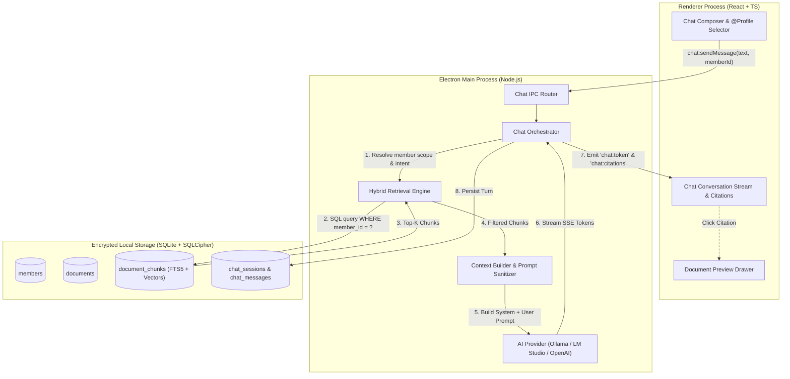
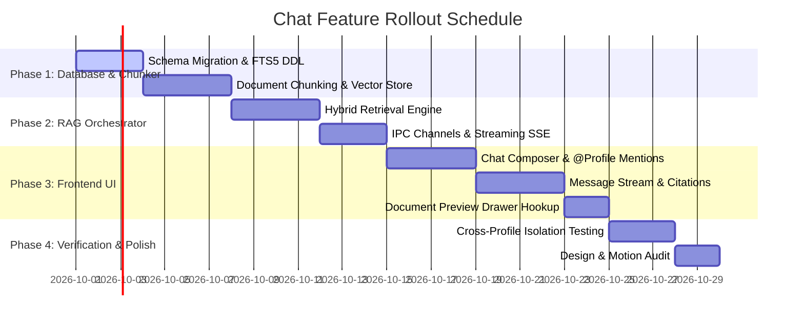

# Feature Specification: Profile-Scoped Document Chat Assistant ("Chat with Records")

| Metadata | Details |
|---|---|
| **Feature Name** | Profile-Scoped Document Chat Assistant |
| **Status** | Approved for Implementation |
| **Target Version** | MedBuddy v2.1.0 |
| **Authors** | MedBuddy Core Team |
| **Related Documents** | [PRD Phase 2](file:///home/sash/coding/medbuddy/docs/prd-family-medical-vault-Phase2.md), [Design System v2](file:///home/sash/coding/medbuddy/docs/Designv2.md), [Motion Specs](file:///home/sash/coding/medbuddy/plans/001-core-motion-tokens-and-reduced-motion.md) |
| **Last Updated** | 2026-09-25 |

---

## 1. Executive Summary & Problem Statement

### 1.1 Problem
Family medical vaults quickly accumulate dozens or hundreds of lab reports, discharge summaries, imaging reports, and prescriptions across multiple family members (Self, Spouse, Children, Aging Parents). When patients or caregivers have questions—such as *"When was Dad's last cardiology visit and what was the EF?"* or *"What did the pediatrician prescribe for Maya's rash last March?"*—they currently must manually hunt through folders, open individual PDFs, or run full overview syntheses.

Furthermore, medical data is intensely personal and distinct per individual. Mixing up records between family members (e.g., attributing a parent's diabetic medication to a child or spouse) is clinically dangerous and causes severe user distrust.

### 1.2 Solution
The **Profile-Scoped Document Chat Assistant** introduces an interactive, conversational medical assistant into MedBuddy that:
1. **Scopes Document Retrieval to a Specific Family Profile**: Users can select which family member's records are being queried directly from the chat message composer via an intuitive profile pill or inline `@profile` mentions.
2. **Performs Hybrid Local RAG (Retrieval-Augmented Generation)**: Automatically searches the selected profile's ingested documents, OCR transcripts, lab tables, and clinical summaries using hybrid keyword (SQLite FTS5) and dense vector retrieval.
3. **Generates Grounded Answers with Interactive Citations**: Streams clinical answers referencing exact source documents, report dates, and page numbers that users can click to inspect in the preview drawer.
4. **Preserves Absolute Data Privacy**: Operates 100% locally and offline when paired with local models (Ollama, LM Studio) with zero cross-profile leakage at the database query level.

---

## 2. User Experience & Interaction Design

### 2.1 Entry Points
- **Sidebar Primary Navigation**: A dedicated **"Chat / Assistant"** navigation item (`lucide-react: MessageSquareText` or `Bot`) with shortcut `⌘4` / `Ctrl+4`.
- **Profile Dashboard Quick Action**: A prominent *"Ask records about [Name]..."* prompt card on the member dashboard that opens the assistant pre-scoped to that family member.
- **Document Preview Action**: An *"Ask assistant about this document"* button inside the Document Preview drawer, initiating a session scoped to the document's owner profile and pre-tagging the active document.

```
+---------------------------------------------------------------------------------------------------+
|  MedBuddy Vault            [ Dad (Robert) v ]                          [Search...]  [Theme] [Sync] |
+---------------------------------------------------------------------------------------------------+
| [Sidebar]       |  Chat Assistant: Dad (Robert)                                                   |
| > Dashboard     |  Scoped to 24 records • Local (Llama 3.3 70B via LM Studio)                     |
| > Documents     |---------------------------------------------------------------------------------|
| > Timeline      |  User: What was his PSA trend across 2023 and 2024?                             |
| > Overviews     |                                                                                 |
| * Chat (Active) |  Assistant:                                                                     |
|                 |  Robert's PSA (Prostate-Specific Antigen) was measured twice:                   |
|                 |  1. **Oct 14, 2023**: 2.4 ng/mL [Normal: 0.0 - 4.0 ng/mL]                       |
|                 |     Source: [PSA_Lab_2023-10-14.pdf • p.1]                                      |
|                 |  2. **Nov 20, 2024**: 3.8 ng/mL [Normal: 0.0 - 4.0 ng/mL]                       |
|                 |     Source: [Annual_Physical_2024-11-20.pdf • p.2]                              |
|                 |                                                                                 |
|                 |  Observation: The value rose by 1.4 ng/mL over 13 months. While still within     |
|                 |  the normal reference range, this rate of increase warrants clinical review.   |
|                 |                                                                                 |
|                 |---------------------------------------------------------------------------------|
|                 |  [ @ Dad (Robert) [x] ] Ask a question about Dad's medical records...     [Send] |
+---------------------------------------------------------------------------------------------------+
```

---

### 2.2 Chat Composer with Dynamic Profile Selection

The message input composer is the central control point for scoping queries to family profiles.

#### A. Interactive Scope Pill in Composer
- By default, the composer reflects the active session profile or the currently active member in the sidebar.
- A prominent, clickable **Profile Pill** is rendered at the top-left or inside the message composer:
  - Displays the member's avatar dot (using `avatar_color`), member name, and total document count (e.g. `● Dad (24 docs)`).
  - Clicking the pill opens a fast dropdown to switch the target profile for this query or session.
  - A subtle clear button `[✕]` allows clearing the scope to switch to "All Profiles" (with a mandatory privacy confirmation prompt if cross-profile querying is enabled).

#### B. Inline `@profile` Mentions
- Typing `@` anywhere in the chat message input displays a floating autocomplete menu of all family members.
- Autocomplete displays:
  - Member Avatar & Name (e.g. `● Mom (Eleanor)`)
  - Relationship badge (`Spouse`, `Parent`, `Child`)
  - Document count (`18 documents`)
- Selecting a member converts the text to a high-contrast chip/badge (e.g., `@Mom`) and immediately binds the retrieval scope of the query to that specific member.
- Keyboard navigation: `Up`/`Down` arrow keys to navigate the list, `Enter` or `Tab` to select, `Escape` to dismiss.

#### C. Empty Vault / Zero-State Handling
- If a user selects a profile with 0 indexed documents, the assistant displays an informative notice:
  - *"Dad (Robert) doesn't have any uploaded medical documents yet. [Upload PDF/Image] to enable chat questions."*

---

### 2.3 Conversational Response & Provenance UI

1. **Streaming Token Display**:
   - Responses stream in real-time using Electron IPC event channels.
   - Smooth text appearance using the standard design typography tokens (Inter/Charter, 15px, line-height 1.6).

2. **Reasoning / Thinking Drawer**:
   - For reasoning-capable models (e.g., DeepSeek-R1, Qwen 2.5), internal reasoning is captured and displayed in a collapsible *"Clinical Reasoning Thought Process"* drawer above the final answer, collapsed by default to preserve legibility.

3. **Interactive Citations & Source Badges**:
   - Every factual claim citing a record displays an inline pill: `[DocName • YYYY-MM-DD • Page N]`.
   - Hovering over a badge displays a preview tooltip showing the extracted chunk snippet.
   - Clicking the badge slides open the right-side `DocumentPreview` drawer directly focused on that document and page.

4. **Medical Disclaimer & Safety Banner**:
   - Persistent subtle footer: *"MedBuddy Assistant provides synthesis and document search for informational purposes only. Consult a licensed physician for medical advice or diagnostic evaluation."*

---

## 3. System Architecture & Technical Specifications



### 3.1 Strict Security & Cross-Profile Isolation Guarantee

> [!CAUTION]
> **Zero Cross-Profile Leakage Rule**: Medical records of different family members must NEVER be mixed during retrieval unless explicitly requested by the user.

- **Query-Level Enforcement**: Retrieval filters (`WHERE member_id = :memberId`) are strictly enforced at the SQL and vector search level, **never solely at the LLM prompt level**.
- Even if a user prompts *"Tell me Mom's cholesterol, but I selected Dad"*, the retrieval engine only pulls Dad's chunks into the LLM context. The system prompt instructs the model: *"You only have access to records for [Selected Member]. If asked about another person, inform the user to switch the profile scope."*

---

## 4. Ingestion & Retrieval Pipeline

### 4.1 Document Ingestion & Chunking
When a document is imported or OCR finishes:
1. **Document Text Extraction**: Extract cleaned text from PDF/PaddleOCR/LLM Vision.
2. **Medical Table & Section Chunking**:
   - Lab reports are chunked preserving table headers and rows together (window size: 400–600 tokens with 80-token overlap).
   - Each chunk is tagged with metadata:
     - `member_id`: The ID of the family member who owns the folder.
     - `document_id`: Source document ID.
     - `document_date`: Clinical collection or report date.
     - `page_number`: 1-based page index.
     - `tags`: Document categories (e.g. `bloodwork`, `cardiology`, `prescription`).
3. **Dual Indexing**:
   - **Full-Text Search (FTS5)**: Stored in SQLite virtual table `document_chunks_fts` for exact matching of drug names, units, and numeric lab values.
   - **Vector Embedding**: Vector embedding generated via local embedding endpoint (`/v1/embeddings` from Ollama `nomic-embed-text` or `bge-small-en-v1.5`) and indexed for semantic search.

### 4.2 Hybrid Retrieval Algorithm
When a chat query arrives:
1. **Scope Filtering**:
   - Find all `folder_ids` belonging to `targetMemberId`.
   - Filter candidate chunks where `document_chunks.member_id = targetMemberId`.
2. **Hybrid Search Execution**:
   - **Keyword Retrieval**: Execute BM25 ranking via `document_chunks_fts MATCH :query` limited to the target member (Score $S_{bm25}$).
   - **Dense Semantic Retrieval**: Generate query vector embedding and compute cosine similarity against target member's chunk vectors (Score $S_{vec}$).
   - **Reciprocal Rank Fusion (RRF)**:
     $$RRF(d) = \frac{w_{bm25}}{60 + r_{bm25}(d)} + \frac{w_{vec}}{60 + r_{vec}(d)}$$
3. **Re-ranking & Top-K Selection**:
   - Select top $K$ chunks (default: $K = 8$, max context budget: 6,000 tokens).
   - Order chronologically or by relevance to provide clear timeline context to the LLM.

---

## 5. System Prompt & Grounding Contract

The `ChatOrch` compiles the prompt with strict medical grounding rules:

```markdown
You are MedBuddy Assistant, a precise and compassionate personal medical records assistant.
You are currently reviewing medical records for: {{MEMBER_NAME}} (Relationship: {{MEMBER_RELATIONSHIP}}, DOB: {{MEMBER_DOB}}).

CRITICAL DIRECTIVES:
1. SCOPE RESTRICTION: You only have access to documents belonging to {{MEMBER_NAME}}. Do NOT invent records, speculate on other family members, or use outside clinical assumptions.
2. GROUNDING & CITATIONS: Every claim regarding test results, diagnoses, medications, or doctor visits MUST cite the source document using the format: [Doc: {document_id}, Page: {page_number}, Date: {document_date}].
3. TEMPORAL ACCURACY: Always note the date of each cited finding so the user understands the chronological sequence (e.g., "In your June 2023 panel vs your September 2024 panel...").
4. LAB RANGES & TRENDS: When discussing biomarkers, specify the numeric value, unit, reference range, and whether it was normal or out-of-range.
5. DISCLAIMER: When discussing abnormal values or medication questions, advise the user to discuss the specific findings with their physician.

RETRIEVED CLINICAL CONTEXT FOR {{MEMBER_NAME}}:
---
{{RETRIEVED_CHUNKS_BLOCK}}
---

CONVERSATION HISTORY:
{{RECENT_MESSAGES_BLOCK}}

USER QUERY:
{{USER_MESSAGE}}
```

---

## 6. Database Schema & Data Models

### 6.1 Database Migration DDL (`src/main/db/schema.ts`)

```sql
-- 1. Document Chunks for RAG
CREATE TABLE IF NOT EXISTS document_chunks (
  id TEXT PRIMARY KEY,
  document_id TEXT NOT NULL,
  member_id TEXT NOT NULL,
  chunk_index INTEGER NOT NULL,
  chunk_text TEXT NOT NULL,
  page_number INTEGER NOT NULL DEFAULT 1,
  document_date TEXT,
  embedding_model TEXT,
  embedding BLOB, -- Float32 vector blob or external vector index ref
  created_at TEXT NOT NULL,
  FOREIGN KEY (document_id) REFERENCES documents (id) ON DELETE CASCADE,
  FOREIGN KEY (member_id) REFERENCES members (id) ON DELETE CASCADE
);

CREATE INDEX IF NOT EXISTS idx_doc_chunks_member ON document_chunks(member_id);
CREATE INDEX IF NOT EXISTS idx_doc_chunks_doc ON document_chunks(document_id);

-- 2. FTS5 Virtual Table for Keyword Match
CREATE VIRTUAL TABLE IF NOT EXISTS document_chunks_fts USING fts5(
  chunk_text,
  content='document_chunks',
  content_rowid='rowid'
);

-- Triggers to keep FTS index synchronized
CREATE TRIGGER IF NOT EXISTS trg_chunks_ai AFTER INSERT ON document_chunks BEGIN
  INSERT INTO document_chunks_fts(rowid, chunk_text) VALUES (new.rowid, new.chunk_text);
END;
CREATE TRIGGER IF NOT EXISTS trg_chunks_ad AFTER DELETE ON document_chunks BEGIN
  INSERT INTO document_chunks_fts(document_chunks_fts, rowid, chunk_text) VALUES('delete', old.rowid, old.chunk_text);
END;

-- 3. Chat Sessions
CREATE TABLE IF NOT EXISTS chat_sessions (
  id TEXT PRIMARY KEY,
  member_id TEXT, -- NULL denotes all-vault (if user explicitly confirms)
  title TEXT NOT NULL,
  provider_profile_id TEXT NOT NULL,
  model_name TEXT NOT NULL,
  created_at TEXT NOT NULL,
  updated_at TEXT NOT NULL,
  FOREIGN KEY (member_id) REFERENCES members (id) ON DELETE CASCADE,
  FOREIGN KEY (provider_profile_id) REFERENCES provider_profiles (id) ON DELETE SET NULL
);

CREATE INDEX IF NOT EXISTS idx_chat_sessions_member ON chat_sessions(member_id);
CREATE INDEX IF NOT EXISTS idx_chat_sessions_updated ON chat_sessions(updated_at DESC);

-- 4. Chat Messages
CREATE TABLE IF NOT EXISTS chat_messages (
  id TEXT PRIMARY KEY,
  session_id TEXT NOT NULL,
  role TEXT NOT NULL, -- 'user' | 'assistant' | 'system'
  content TEXT NOT NULL,
  reasoning_content TEXT,
  scoped_member_id TEXT, -- Member targeted for this specific message turn
  cited_chunks_json TEXT NOT NULL DEFAULT '[]', -- JSON array of CitedChunk references
  latency_ms INTEGER,
  token_count INTEGER,
  created_at TEXT NOT NULL,
  FOREIGN KEY (session_id) REFERENCES chat_sessions (id) ON DELETE CASCADE
);

CREATE INDEX IF NOT EXISTS idx_chat_messages_session ON chat_messages(session_id, created_at ASC);
```

### 6.2 TypeScript Interfaces (`src/shared/types.ts`)

```typescript
export interface CitedChunk {
  chunkId: string;
  documentId: string;
  filename: string;
  pageNumber: number;
  documentDate?: string;
  snippet: string;
  similarityScore?: number;
}

export interface ChatMessageItem {
  id: string;
  sessionId: string;
  role: 'user' | 'assistant' | 'system';
  content: string;
  reasoningContent?: string;
  scopedMemberId?: string;
  citedChunks: CitedChunk[];
  latencyMs?: number;
  tokenCount?: number;
  createdAt: string;
}

export interface ChatSessionItem {
  id: string;
  memberId: string | null; // Primary member scope
  title: string;
  providerProfileId: string;
  modelName: string;
  createdAt: string;
  updatedAt: string;
  messageCount?: number;
}

export interface SendChatMessageParams {
  sessionId?: string;
  memberId: string; // Explicitly selected profile
  prompt: string;
  providerProfileId?: string;
}

export interface ChatStreamEvent {
  sessionId: string;
  messageId: string;
  tokenDelta?: string;
  reasoningDelta?: string;
  citedChunks?: CitedChunk[];
  done: boolean;
  error?: string;
}
```

---

## 7. Electron IPC Contract

```typescript
// IPC API extensions exposed on window.medbuddy
export interface MedBuddyChatAPI {
  // Session management
  listChatSessions: (memberId?: string) => Promise<ChatSessionItem[]>;
  getChatSession: (sessionId: string) => Promise<{ session: ChatSessionItem; messages: ChatMessageItem[] } | null>;
  createChatSession: (params: { memberId: string; title?: string; providerProfileId?: string }) => Promise<ChatSessionItem>;
  deleteChatSession: (sessionId: string) => Promise<void>;

  // Messaging & Retrieval
  sendMessage: (params: SendChatMessageParams) => Promise<{ messageId: string; sessionId: string }>;
  abortStream: (sessionId: string) => Promise<void>;
  onChatStream: (callback: (event: ChatStreamEvent) => void) => () => void;

  // Diagnostics & manual test search
  searchProfileDocuments: (memberId: string, query: string, limit?: number) => Promise<CitedChunk[]>;
}
```

---

## 8. Frontend Component Hierarchy

The Chat UI lives within `src/renderer/components/chat/` and integrates smoothly into `App.tsx`:

```
src/renderer/components/chat/
├── ChatAssistantView.tsx        # Main view container (Header, History, Composer)
├── ChatSessionSidebar.tsx      # Past sessions list, grouped by date & member
├── ChatMessageList.tsx         # Virtualized or auto-scrolling message stream
├── ChatMessageItem.tsx         # Message bubble with Markdown formatting & citations
├── ChatCitationBadge.tsx       # Pill showing document citation; opens Preview on click
├── ChatComposer.tsx            # Rich input bar with @profile mention & pills
├── ProfileScopeSelector.tsx    # Dropdown pill selector with avatar color & doc count
├── MentionAutocomplete.tsx     # Floating popup menu on '@' keypress
└── EmptyChatState.tsx          # Starter questions ("Summarize recent bloodwork", etc.)
```

### 8.1 Motion & Design Tokens Alignment
- Follows [Motion Spec 001](file:///home/sash/coding/medbuddy/plans/001-core-motion-tokens-and-reduced-motion.md):
  - Mention autocomplete popup uses `animate-fade-in-scale` (150ms cubic-bezier curve).
  - Scope pill transitions use `transition-colors duration-150`.
  - Thinking drawer expands with `animate-slide-down`.
- Follows [Design System v2](file:///home/sash/coding/medbuddy/docs/Designv2.md):
  - Calibrated clinical color tokens: Primary brand `#14b8a6` (Teal), Warm Neutral dark `#0f172a`, Muted Gray `#64748b`.
  - Member Avatar colors match `MEMBER_AVATAR_COLORS` throughout the app.

---

## 9. Edge Cases & Resilience

| Scenario | System Behavior |
|---|---|
| **Member has 0 documents** | Disable query execution; render empty state pill with quick *"Upload Document"* action button. |
| **No Local AI Provider Configured** | Prompt user to connect LM Studio or Ollama in Provider Settings before sending message. |
| **Switching Profile Mid-Chat** | If the user enters `@Mom` in a session previously dedicated to `Dad`, display a gentle prompt: *"Switching to Mom's documents for this question"* and update message's `scoped_member_id` without losing conversational context. |
| **Ambiguous / Out-of-Scope Query** | If query asks for information not in the member's records (e.g. *"What is my genetic carrier status?"* when no genetic panel exists), assistant explicitly replies that no such record exists in the uploaded files. |
| **Document Deletion** | Deleting a document cascadingly deletes all its `document_chunks` and FTS index entries via foreign key triggers. Past chat messages retain text but mark the citation as *"Archived / Deleted document"*. |
| **Context Window Overflow** | If retrieved chunks + multi-turn history exceed 8k tokens, truncate older conversational turns while preserving the system prompt, member clinical profile summary, and top-ranked chunks. |

---

## 10. Phased Implementation Plan



### Acceptance Criteria
- [ ] **Profile Scoping**: Searching documents via chat for Member A never returns or cites documents belonging to Member B.
- [ ] **Inline Composer Mention**: Typing `@` in the chat input lists all family members with avatar and document counts; selecting one updates the active search scope.
- [ ] **Interactive Citations**: Every assistant citation can be clicked to open the exact document and page in the preview drawer.
- [ ] **Streaming Token Performance**: First token appears within < 1.2s on local LM Studio / Ollama instances.
- [ ] **Offline Operation**: Complete functionality works when disconnected from the internet when using local model profiles.
